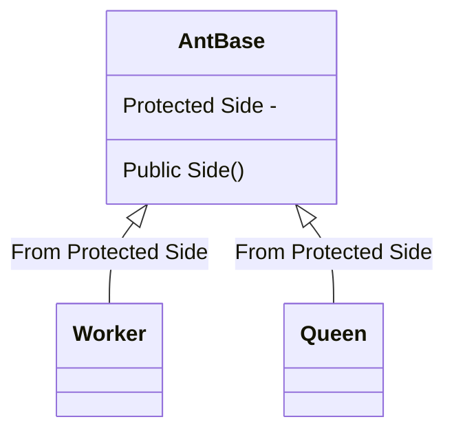
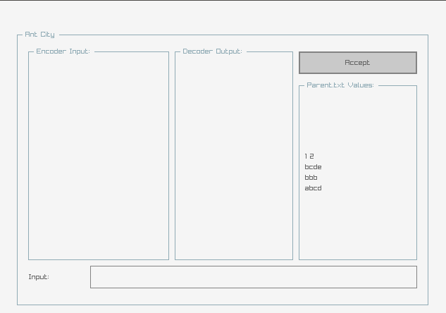

# Ant-City-DSA-Project

---

# Problem Explanation

In the city of ants, every ant's body structure is defined by a string of **English letters**, equivalent to human DNA.

> For example, one ant may be identified by the string *"abcd"* although another ant may be represented by the string *"x"*

The ant city contains two types of ants: **queen ants** and **worker ants**.

During a reproductive cycle, if substrings from a worker and the queen ant share the same prefix, offspring with those substrings are born.

> For instance, suppose the worker ant has the string *"xyzy"* and the queen ant has *"yzxx"* the offspring will be *"yz"* and two *"y"*

All newly born ants form a queue to enter the **city**. In this queue, there are also some **outsider ants** trying to enter the city. These outsider ants seem different any of the ant children, and their **unique strings** make them obviously noticed.

The city's **gatekeeper** is in responsibility for blocking outsider ants out and organizing and protecting their children.

You have to:

Identify and erase outsider ants from the entry queue, utilizing lists of worker and queen ants.

Delivery requirements:

In this project, you must be able to provide two programs: Encoder and Decoder.

The **Encoder** program ought to read worker and queen ants from the *"parents.txt"* file and the entry queue from standard input.

After eliminating the outsider ants from the queue, it should keep the ideal order of ant children entry into the city in a file labeled *"order"*

The **Decoder** program should be able to decode the *"order"* file using the *"parents.txt"* file and print all offspring in the correct order to the standard output.

the primary goal of this project is to shrink the size of the *"order"* file.

Input and output:

The *"parents.txt"* file provides the number of queen and worker ants first, then their strings. In different lines, **queen ants come first**.

In standard **input**, the first line decides the queue length, and each following line contains the string of each ant.

In standard **output (Decoder)**, print the ants one at a time on separate lines, in the order they were entered.

---

# Example

```
parents.txt:
1 2
bcde
bbb
abcd

Encoder’s standard input:
b
bc
x
b
bcd
x
b
bcde
b

Decoder’s standard output:
b
bc
b
bcd
b
b 
```

---

# Solution Explanation

### Containers

For this project I built two custom data container and use one standar container:

 1. **std vector** : for quick storing data, even for file handling and string manipulation.
 2. **Hash Set** : to store **ant dna's and the children** from breeding. I used this to access, insert, delete with the time complexity of **O(1)**.
 3. **Queue** : for the **city structure**. Almost everything done with the time complexity of **O(1)**.

### Ants

then I created ants class structure to use the most of them.



I used ant base for two reason, queen and worker ants from the protected side of it to access DNA and SetDNAs method. the public side has two methods to help with the setting the dna.

with this approach i can use ant base for handling ants and worker and queen ant can have their DNA.

queen ant has the method for breeding that gets workers.

### Encoder & Decoder

The encoder handels thease properties :

```C++
 AntBase antHandler;      // for getting the DNAs
 strvec fileData;         // the data we will get from prents.txt

 Queen queens;            // queens that we will use
 int queensCount;         // ants count
 strvec queenDnas;        // queens dna

 Worker workers;          // workers that we will use
 int workersCount;        // ants count
 strvec workerDnas;       // workers dna

 strhash children;        // the children from breeding workers and queens
 strque city;             // the city that we will getting it from user
 strque validCity;        // this will be our output
```

Encoder will first initialize the queen and worker ants, then start the breeding. Then it will get the city entry. After Validating each citizen and delete the outsiders we save them to the **Order** file.

Decoder will read from **Order** and return the validated citizens.

### Main Program

For the visualisation I used Raylib and Raygui. The Program has 4 parts :



**Encoder** and **Decoder** are explained above. I created a box for **parent.txt** that previews the values. The **Input** field would gets each citizen to be validated, you only have to write them one b one then hit enter.
